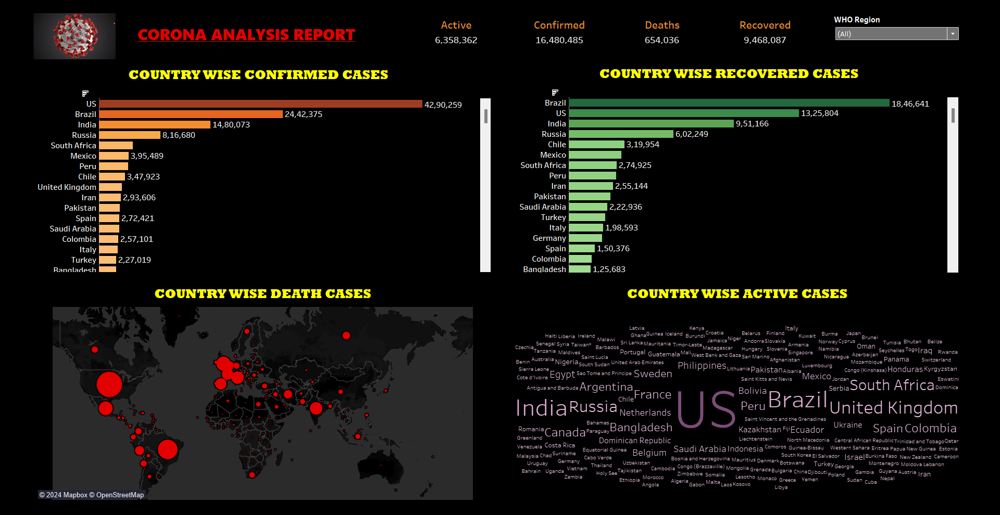

# Country-Covid-19-Tableau-Dashboard

## Introduction :

This Project includes the Covid-19 Country wise information. In this we have all the information related to Active Cases, Death Cases, Confirmed Cases and Recovered Cases. It consist of total 187 Countries and shows the comparison between the countries based on the Covid Data. From this we can find that The United States had maximum confirmed cases followed by Brazil whereas Brazil had more recovered cases followed by US. This Project is helpful in gaining information about how many country suffered from Corona Virus and to whom it affect the most and to whom the least, which country has recovered earlier and which one later and etc. This Project will give you numerous information about the Covid-19 Country wise.

---------------------------------------------------------------------------------------------------------------------------------------------------------------------------

## This Project Includes :

- **Data Import :** Connected data from the Text File and Transform it by ensuring accurate Data Type.
- **Data Processing :** Ensured accuracy and consistency in the data with the help of Excel Advanced Features.
- **Performing Descriptive Analysis :** Created various Calculated Fields, generated KPI by selecting the significant columns from vast data
- **Data Visualization :** Constructed some meaningful insights from the processed data through Show me Field and alter the format of charts in Marks Pane.
- **Creation of Dashboard :** Assembled all the significant worksheets in the dashboard sheet with some additional features like Filters, Images etc. from the Objects field.

---------------------------------------------------------------------------------------------------------------------------------------------------------------------------

## Dashboard :

  

---------------------------------------------------------------------------------------------------------------------------------------------------------------------------

## Project KPI :

In this project, the generated Measures show the total active cases is 6.4M, the total confirmed cases is 16.5M, the total death cases is 0.7M and the total recovered cases is 9.5M which was displayed in the form of KPI. From this, I came to know that out of total confirmed cases, 57.4% were recovered, 38.6% were active and 4.0% were dead. It means the medical facilities development were in the fast track that leads to lesser death than recovered.

---------------------------------------------------------------------------------------------------------------------------------------------------------------------------

## Important Questions derived from the Project :

1. Which Region has the highest confirmed cases and how much percent it is distributed to the dead, active and recovered cases ?
2. Which Country has the highest confirmed cases and which has the least ?
3. Which Country has the highest recovered cases than the others ?
4. Which Country has the maximum death report and which one has the least death report ?
5. Which Country has the maximum active cases than others ?

----------------------------------------------------------------------------------------------------------------------------------------------------------------------------------------

## Based on the report Insights, here are the outcomes :

1. In this Project, I have used WHO Region as filter, in order to know which Region has affected the most, then I got to know that American Region has highest Confirmed Cases i.e. 8.8M out of which 50.6% were recovered, 45.6% were active and 3.9% were dead. whereas Western Pacific has least affected by Corona as only 0.3M was confirmed cases out of which 70.7% were recovered, 26.5% were active and only 2.8% were dead.

2. From this Horizontal Bar Chart of Country-wise Confirmed Cases, I came to know that US Country has the maximum Confirmed Cases followed by Brazil and India, whereas Western Sahara has the least Confirmed Cases
followed by Holy See and Greenland.

3. From this Horizontal Bar Chart of Country-wise Recovered Cases, I came to know that Brazil Country has the maximum Recovered Cases followed by US and India, whereas Canada, Mozambique, Serbia, Sweden, Syria and Timor-Leste has the no Recovered Cases and Western Sahara has the least Recovered Cases followed by Papua New Guinea and Holy See.

4. From this Map Chart of Country-wise Death Cases, I came to know that US Country has the maximum Death Cases followed by Brazil and UK, whereas Western Sahara has the least Death Cases and many countries have no Death cases.

5. From this Word Chart of Country-wise Active Cases, I came to know that US Country has the maximum Active Cases followed by Brazil and India, whereas Western Sahara has the least Active Cases and some countries has no Active Cases.

--------------------------------------------------------------------------------------------------------------------------------------------------------------------

## Conclusion :

This Project is just for knowledge purpose with the motive of gaining qualitative information about the countries who have suffered from the Covid Pandemic. In the overview I can say that major countries that were affected by Corona are US, Brazil, India, UK, Russia etc. and these countries mostly belong from the regions Americans, South-East Asia and Europe. In these countries, better medical facilities are also available to deal with this infectious disease that's why their recovered cases was almost half and least were dead. This Dashboard is helpful to know the Worldwide history of 2020-21, the period of Covid-19 when almost whole country was under Quarantine.

--------------------------------------------------------------------------------------------------------------------------------------------------------------------

## Author :

- [@Ritika821](https://github.com/Ritika821)
- Ritika - Data Analyst

--------------------------------------------------------------------------------------------------------------------------------------------------------------------
